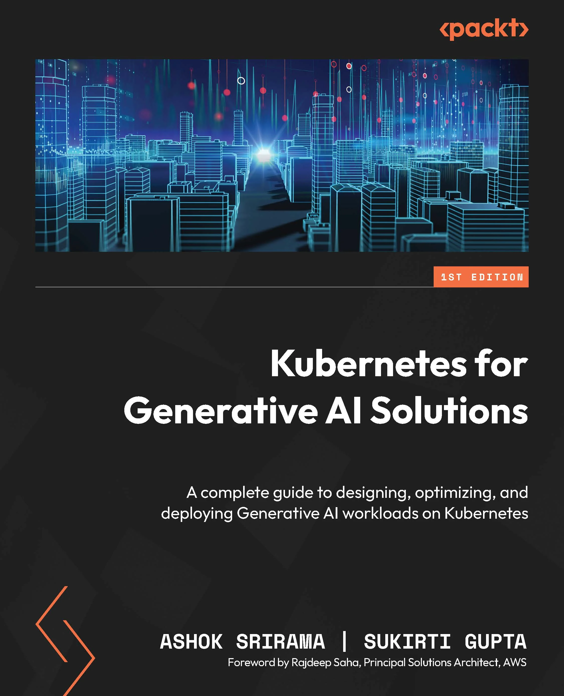

# [Book][Ashok Srirama, Sukirti Gupta] Kubernetes for Generative AI Solutions [ENG, 2025]

**original src:**  
https://github.com/PacktPublishing/Kubernetes-for-Generative-AI-Solutions

**A complete guide to designing, optimizing, and deploying Generative AI workloads on Kubernetes**

## What is this book about?

Learn step by step how to design, optimize, and deploy Generative AI projects on Kubernetes. Covering networking, observability, security, scaling, and cost optimization strategies, this guide takes you from first deployment to production excellence.

 

This book covers the following exciting features:

- Explore GenAI deployment stack, agents, RAG, and model fine-tuning
- Implement HPA, VPA, and Karpenter for efficient autoscaling
- Optimize GPU usage with fractional allocation, MIG, and MPS setups
- Reduce cloud costs and monitor spending with Kubecost tools
- Secure GenAI workloads with RBAC, encryption, and service meshes
- Monitor system health and performance using Prometheus and Grafana
- Ensure high availability and disaster recovery for GenAI systems
- Automate GenAI pipelines for continuous integration and delivery

 

**Following is what you need for this book:**
This book is for solutions architects, product managers, engineering leads, DevOps teams, GenAI developers, and AI engineers. It's also suitable for students and academics learning about GenAI, Kubernetes, and cloud-native technologies. A basic understanding of cloud computing and AI concepts is needed, but no prior knowledge of Kubernetes is required.

With the following software and hardware list you can run all code files present in the book (Chapter 1-14).

 

## Chapters:

**Part 1: GenAI and Kubernetes Foundation**

<ol>
  <li>📖 Generative AI Fundamentals</li>
  <li>✅ Kubernetes – Introduction and Integration with GenAI</li>
  <li>✅ Getting Started with Kubernetes in the Cloud</li>
</ol>

**Part 2: Productionalizing GenAI Workloads Using K8s**

<ol start="4">
  <li>📖 GenAI Model Optimization for Domain-Specific Use Cases</li>
  <li>Working with GenAI on K8s: Chatbot Example</li>
  <li>Scaling GenAI Applications on Kubernetes</li>
  <li>Cost Optimization of GenAI Applications on Kubernetes</li>
  <li>Networking Best Practices for Deploying GenAI on K8s</li>
  <li>Security Best Practices for Deploying GenAI on Kubernetes</li>
  <li>Optimizing GPU Resources for GenAI Applications in Kubernetes</li>
</ol>

**Part 3: Operating GenAI Workloads on K8s**

<ol start="11">
  <li>GenAIOps: Data Management and the GenAI Automation Pipeline</li>
  <li>Observability – Getting Visibility into GenAI on K8s</li>
  <li>📖 High Availability and Disaster Recovery for GenAI Applications</li>
  <li>Wrapping Up: GenAI Coding Assistants and Further Reading</li>
</ol>

 

### Software and Hardware List

| Chapter | Software/Hardware Required | OS Required                                    |
| ------- | -------------------------- | ---------------------------------------------- |
| 1–14    | Operating system           | Linux, macOS, Windows (via WSL)                |
| 1–14    | Kubernetes                 | Amazon EKS, kind (for local testing)           |
| 1–14    | AI/ML frameworks           | Hugging Face Transformers, PyTorch, TensorFlow |
| 1–14    | Accelerators               | NVIDIA GPUs, AWS Trainium/Inferentia           |
| 1–14    | Observability              | Prometheus, Grafana, OpenTelemetry, Loki       |
| 1–14    | Automation                 | Kubeflow, MLflow, Ray, Argo Workflows          |
| 1–14    | Security tools             | OPA, Kyverno                                   |

  

---

 

<a href="https://aiops.ru/">Предложить инженеру работу / подработку на проекте с kubernetes, microservices, machine learning, big data, golang</a>
